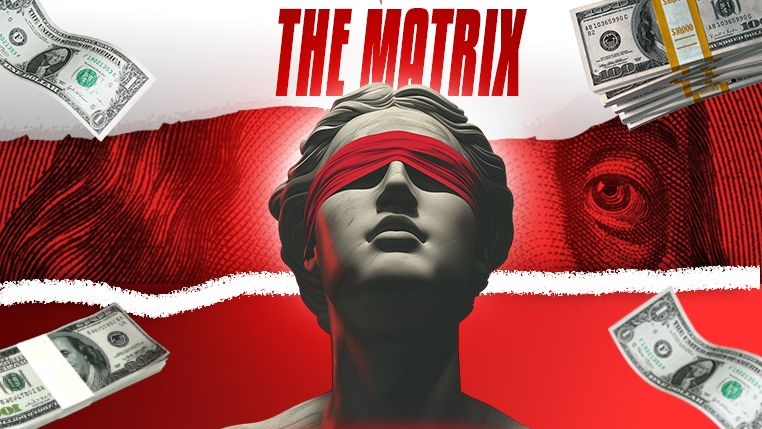

  <!-- Custom Matrix Banner -->
  

  <!-- Animated Typing SVG Effect -->
  

  <!-- Red Themed Dynamic Wave Divider -->
  

  <!-- Red / Dark Themed Badges -->
  

    
    
    
  

---

### 🔴 Red Pill: System Architecture & Skills

  

---

### 👁️ Matrix Operations & Stats

  
  

---

  

